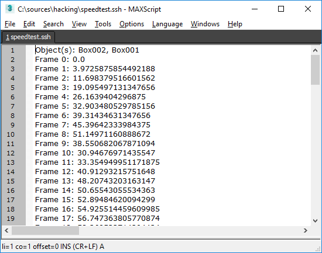

# HowTo: speedsheet



[Original MaxScript Tutorial](https://help.autodesk.com/view/3DSMAX/2020/ENU/?guid=GUID-2DB3A775-776F-4D63-BDFB-D99523ECB69D)
[Source Code](speedsheet/__init__.py)

*Goals:* 
- open a file selection dialog in 3ds Max
- use file io in python
- use pymxs.attime, pymxs.runtime.selection, pymxs.runtime.animationRange
- open a text file in the 3ds Max text editor

Non Goal:
- explaining how to connect a python function to a menu item (this is done
in other samples like [removeallmaterials](/removeallmaterials/README.md))

## Explanations

The following example will create a macroScript that will output the speed of the 
current object selection on each frame and its average speed to a text file.

A difference with the MAXScript version of the sample is that we use python 
file io instead of pymxs file io in the python sample.

## Using the tool

From the 3ds Max listener window we can do:

```python
import speedsheet

speedsheet.startup()
```

If we install this sample as a pip package it will be automatically
started during the startup of 3ds Max (because it defines a startup
entry point for 3ds Max).

## Understanding the code

The speedsheet function in [speedsheet/\_\_init\_\_.py](speedsheet/__init__.py) fully
implements this sample.

It first opens a file selection dialog, with a caption and a filter for
file types, using `rt.getSaveFileName`:

```python
    output_name = rt.getSaveFileName(
            caption="SpeedSheet File", 
            types="SpeedSheet (*.ssh)|*.ssh|All Files (*.*)|*.*|")
```

It then opens the selected file for writing using the python `open` function.
The file is opened in a `with` block: this guarantees that no matter what
happens in the block, the file will be closed before exiting the block. This
simplifies the code and makes it more robust at the same time.

```python
        with open(output_name, "w+") as output_file:
```

Next, the code produces a list of objects at the first frame
of the animation. Everything inside the `with pymxs.attime(sometime)` block will
happen at `sometime` in the time line (this is the same as the [at time](https://help.autodesk.com/view/3DSMAX/2020/ENU/?guid=GUID-4E9CCD61-F575-42E1-8654-315DDF6C6A26#GUID-4E9CCD61-F575-42E1-8654-315DDF6C6A26)
construction in MAXScript):

```python
            with pymxs.attime(rt.animationRange.start):
                objdump = ", ".join(map(lambda x: x.name, list(rt.selection)))
                output_file.write(
                    f"Object(s): {objdump}\n")
```

The `map(lambda x: x.name, list(rt.selection))` construct converts the `rt.selection`
(the set of currently selected objects in 3ds Max) in a list of strings (the name
of these objects).

The `", ".join()` call concatenates these strings separated by ", " to produce
a nice list of object names.

The code then iterates the timeline:

```python
            for t in range(int(rt.animationRange.start), int(rt.animationRange.end)):
```

It then computes the position of the selection center at t and t-1:

```python
                with pymxs.attime(t):
                    current_pos = rt.selection.center
                with pymxs.attime(t-1):
                    last_pos = rt.selection.center
```

From this it computes the speed at that time and writes it to the file:

```python
                frame_speed = rt.distance(current_pos, last_pos) * rt.FrameRate
                average_speed += frame_speed
                output_file.write(f"Frame {t}: {frame_speed}\n")
```

When the loop terminates, the average speed of the animation is also logged
to the file:

```python
            average_speed /= float(rt.animationRange.end - rt.animationRange.start)
            output_file.write(f"Average Speed: {average_speed}\n")
```

After the end of the `with open(` block the file is closed automcatically.
We open it the 3ds Max editor:

```python
        rt.edit(output_name)
```
