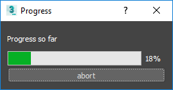

# HowTo: threadprogressbar



*Goal:*
- learn how to update a progress bar from a worker thread

*Non Goal:*
- explaining how to connect a python function to a menu item (this is done
in other samples like [removeallmaterials](/removeallmaterials/README.md))

## Explanations

The tutorial creates a menu item that opens a dialog. When the dialog
is started it launches a thread that does some processing in
the background and notifies the dialog of its progress. A progress bar
shows the percentage of completion of the background job.

Important remark: pymxs is not thread safe. Python threads cannot
call into pymxs. It is possible for python threads to emit QT Signals
that will be processed on the main thread, and this mechanism allows
both UI and pymxs interatction during thread execution.

## Using the tool

From the 3ds Max listener window we can do:

```python
import threadprogressbar

threadprogressbar.startup()
```

If we install this sample as a pip package it will be automatically
started during the startup of 3ds Max (because it defines a startup
entry point for 3ds Max).

## Understanding the code

In [threadprogressbar/\_\_init\_\_.py](threadprogressbar/__init__.py) we
create a menu item. This menu item calls the following function that simply
creates and shows a dialog.

```python
def threadprogressbar():
    '''Update a progress bar from a thread'''
    dialog = ui.PyMaxDialog()
    dialog.show()
```

The dialog is defined in [threadprogressbar/ui.py](threadprogressbar/ui.py). This
file also defines a worker thread, that has a signal and an aborted flag:

```python
class Worker(QThread):
    progress = Signal(int)
    aborted = False
    def __init__(self):
        QThread.__init__(self)

```

Its run function loops from MINRANGE to MAXRANGE, waiting 0.5 second per
iteration. On each iteration it checks if the aborted flag was set and
exits if it's the case. It also emits the current value of the iteration
on its progress signal:

```python
        for i in range(MINRANGE, MAXRANGE):
            self.progress.emit(i)
            time.sleep(0.5)
            if self.aborted:
                return
        self.progress.emit(MAXRANGE)
```

The PySide dialog creates a bunch of widgets including a QProgressBar
that shows the progress of the worker, and a QPushButton that allows
to abort the worker.

```python
        # progress bar
        pb = QProgressBar()
        pb.minimum = MINRANGE
        pb.maximum = MAXRANGE
        main_layout.addWidget(pb)

        # abort button
        btn = QPushButton("abort")
        main_layout.addWidget(btn)
```

It then starts the worker and connects its progress signal to the
setValue function of the pogressbar.

```python
        # start the worker
        self.worker = Worker()
        self.worker.progress.connect(pb.setValue)
        self.worker.start()
```

Finally it connects the clicked signal of the abort button to the
abort function of the worker:

```python
        # connect abort button
        btn.clicked.connect(self.worker.abort)
```
